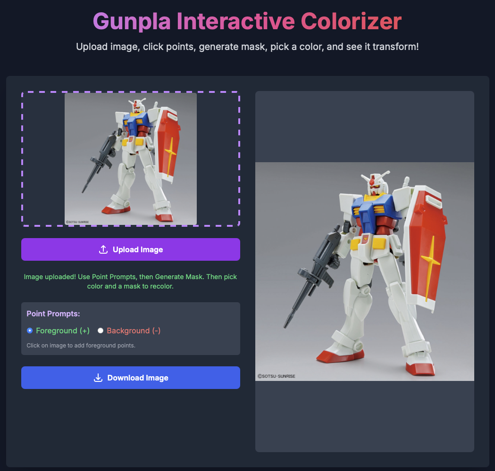
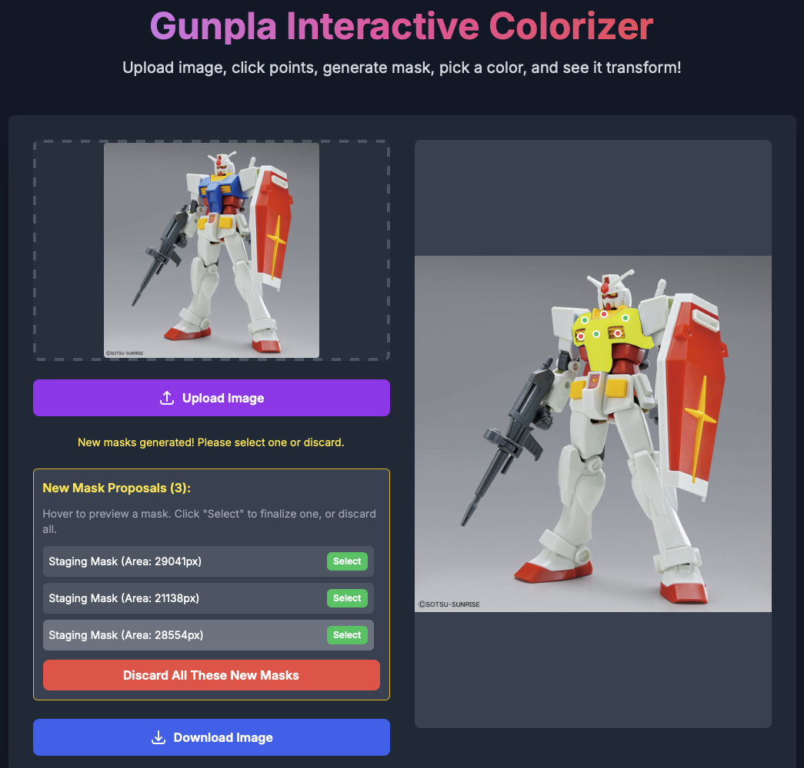
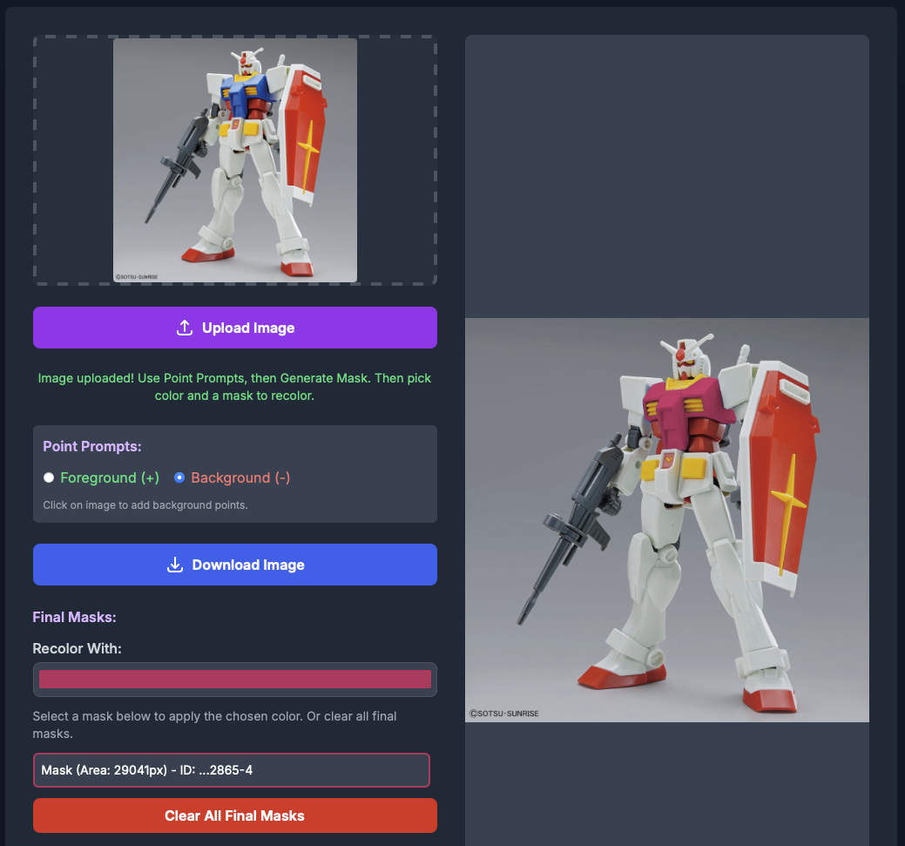

# Gunpla Interactive Colorizer V1 🎨🤖

**Transform your Gunpla models with the power of AI! Upload an image, segment parts with interactive clicks, and recolor them realistically while preserving texture and lighting.**

Ever imagined your favorite Gundam in a custom color scheme? Gunpla Interactive Colorizer makes it easy and fun. Using the advanced Segment Anything Model (SAM), you can precisely select parts of your Gunpla kit from an image. Then, with a simple color picker, change its hue and saturation instantly, all while keeping the original details and shadows intact.

Perfect for Gunpla builders, hobbyists, and anyone looking to experiment with color variations without touching a physical model!

## ✨ Features

*   **Image Upload:** Easily upload JPG, PNG, or WEBP images of your Gunpla.
*   **Interactive AI Segmentation:**
    *   Click foreground (+) and background (-) points on your image.
    *   Leverages the Segment Anything Model (ViT-L) for high-quality part segmentation.
    *   Generates multiple mask proposals for your points.
*   **Mask Staging & Selection:**
    *   Preview generated mask proposals directly on your image.
    *   Select the best-fitting mask from the proposals.
    *   Discard unwanted proposals.
*   **Realistic Recolorization:**
    *   Choose any color from a color picker.
    *   Applies the new color to the selected mask, intelligently preserving the original texture, shading, and lighting by manipulating Hue and Saturation while retaining Lightness (Value).
*   **Live Preview:** See changes in real-time on your image.
*   **Download Your Creation:** Save your customized Gunpla image.
*   **Non-Destructive Workflow:** Image operations are designed to work on a PNG master copy on the backend to minimize quality loss during multiple edits.

## 🚀 Live Demo

Here's a glimpse of the Gunpla Interactive Colorizer in action:

**1. Upload Your Gunpla Image:**

Simply drag & drop or select your image file.
*(Screenshot showing the initial UI with the image upload area)*



**2. Interactive Point Prompting & Mask Generation:**

Click foreground (+) and background (-) points. The AI generates mask proposals for you to choose from. The yellow highlighted areas are previews of the generated masks upon hovering.
*(Screenshot showing points placed on the Gunpla and the "New Mask Proposals" section with hover previews)*



**3. Recolor and Finalize:**

Select a mask, pick your desired color, and see your Gunpla transform! The chosen color (pink in this example) is applied to the selected chest piece.
*(Screenshot showing a part of the Gunpla recolored and the "Final Masks" list)*



<!-- **(Suggestion: For an even better demo, consider recording a short GIF or video showcasing the entire workflow and replacing the static images above!)** -->

## 🛠️ Tech Stack

*   **Frontend:**
    *   Next.js (React Framework)
    *   TypeScript
    *   Tailwind CSS
    *   Axios (for API communication)
*   **Backend:**
    *   FastAPI (Python Web Framework)
    *   Uvicorn (ASGI Server)
    *   OpenCV-Python (for image processing & recoloring)
    *   Pillow (image handling)
*   **AI Segmentation:**
    *   Segment Anything Model (SAM) - ViT-L variant from Facebook Research
    *   PyTorch (for running SAM)
*   **Image Quality:**
    *   Uploaded images are converted to PNG on the backend to serve as a master copy, minimizing quality degradation from repeated save operations during recoloring.

## ⚙️ Getting Started

Follow these instructions to set up and run the Gunpla Interactive Colorizer on your local machine.

### Prerequisites

*   **Python:** Version 3.8 or newer. (Includes `pip` for package management).
*   **Node.js:** Version 18.x or newer. (Includes `npm` for package management).
*   **Git:** For cloning the repository.
*   **(Optional but Recommended for SAM on Apple Silicon Mac):** If you have an M-series Mac, PyTorch can leverage MPS for GPU acceleration. Ensure your macOS and Xcode command-line tools are up to date. For other systems, CUDA (NVIDIA GPU) or CPU will be used.

### 1. Clone the Repository

```bash
git clone https://github.com/YOUR_USERNAME/gunpla-interactive-colorizer.git # Replace YOUR_USERNAME
cd gunpla-interactive-colorizer
```

### 2. Backend Setup

The backend is a Python FastAPI application.

```bash
cd backend

# Create and activate a Python virtual environment
python3 -m venv .venv
source .venv/bin/activate  # On Linux/macOS
# .venv\Scripts\activate    # On Windows

# Install Python dependencies
pip install -r requirements.txt
```

#### SAM Model Checkpoint

The application uses the ViT-L SAM model. You need to download the checkpoint file:

1.  Download `sam_vit_l_0b3195.pth` from the [official SAM repository releases](https.github.com/facebookresearch/segment-anything#model-checkpoints) (or a direct link if available).
2.  Create a directory `backend/models_checkpoints/`.
3.  Place the downloaded `.pth` file into `backend/models_checkpoints/`. The path should be exactly: `backend/models_checkpoints/sam_vit_l_0b3195.pth`.

    *Note: The application is configured to look for this specific path and filename. If you use a different SAM model variant, you'll need to update `MODEL_TYPE` and `SAM_CHECKPOINT_PATH` in `backend/app/services/segmentation_service.py`.*

#### Running the Backend

```bash
# Make sure you are in the 'backend' directory and your virtual environment is active.
uvicorn app.main:app --reload --port 8000
```

The backend API should now be running at `http://localhost:8000`. You can visit this URL in your browser to see a welcome message and SAM model load status.

### 3. Frontend Setup

The frontend is a Next.js application.

```bash
# Open a new terminal window/tab
cd frontend  # Navigate to the frontend directory from the project root

# Install Node.js dependencies
npm install

# Run the frontend development server
npm run dev
```

The frontend should now be running at `http://localhost:3000`. Open this URL in your browser to use the application.

## 📖 How to Use

1.  **Upload Image:** Drag & drop an image of your Gunpla or click the upload area to select a file (JPG, PNG, WEBP supported).
2.  **Initiate Upload:** Click the "Upload Image" button. The image will appear in the main interaction window on the right.
3.  **Point Prompts:**
    *   The "Point Prompts" section will appear on the left.
    *   Select "Foreground (+)" to mark parts of the object you want to select.
    *   Select "Background (-)" to mark areas that are *not* part of the object you want, helping SAM to refine the selection.
    *   Click on the image in the right panel to place your points. Green dots are foreground, red dots are background.
4.  **Generate Masks:**
    *   Once you've placed at least one point, click "Generate Mask from Points".
    *   The AI will process your points and generate mask proposals.
5.  **Select from Proposals:**
    *   The "Point Prompts" section will hide, and a "New Mask Proposals" section will appear.
    *   Hover your mouse over each proposal in the list to see a live preview (in semi-transparent yellow) on the main image.
    *   Click the "Select" button next to the proposal that best fits the part you want.
    *   Alternatively, click "Discard All These New Masks" to clear the proposals and refine your points if needed.
6.  **Recolor Your Mask:**
    *   Once a mask is selected, it's added to the "Final Masks" list.
    *   Use the "Recolor With:" color picker to choose your desired color.
    *   Click on any mask in the "Final Masks" list. The chosen color will be applied to that segment on the main image.
    *   You can change the color picker and click the same mask again to try different colors.
7.  **Multiple Parts:** Repeat steps 3-6 to select and recolor multiple parts of your Gunpla.
8.  **Download:** Once you're happy with your customized Gunpla, click the "Download Image" button (appears after initial upload) to save your creation.

## 🚀 Deployment

Deploying this application involves setting up both the Python backend and the Next.js frontend. Here's a general guide:

### Backend (FastAPI)

*   **Server:** You'll need a server (e.g., a VPS, cloud instance like AWS EC2, Google Cloud Run, Heroku Dyno).
*   **WSGI Server:** Use a production-grade ASGI server like Uvicorn with Gunicorn workers. Example: `gunicorn -w 4 -k uvicorn.workers.UvicornWorker app.main:app`.
*   **Dependencies:** Ensure all Python dependencies from `requirements.txt` are installed in the deployment environment.
*   **SAM Model:** The SAM checkpoint file must be accessible by the backend at the configured path.
*   **Environment Variables:** Consider using environment variables for configurations if needed (e.g., port, model paths).
*   **CORS:** Configure `origins` in `backend/app/main.py` to allow requests from your deployed frontend's domain.
*   **Static Files:** The backend serves uploaded images. Ensure your reverse proxy (like Nginx or Caddy) or cloud service is configured to handle static file serving correctly if needed, or that the FastAPI static files mount is accessible.

### Frontend (Next.js)

*   **Build:** Create a production build of your Next.js app: `npm run build` (inside the `frontend` directory).
*   **Hosting:** Deploy the contents of the `frontend/.next` directory (and often `public` and `package.json` depending on the platform).
    *   **Vercel:** (Recommended for Next.js) Vercel is the creator of Next.js and offers seamless deployment. Simply connect your GitHub repository.
    *   **Netlify:** Similar to Vercel, offers easy deployment for Next.js apps.
    *   **Node.js Server:** You can host it on a Node.js server using `npm start` after building.
    *   **Static Host / CDN:** For a purely static export (if your app doesn't heavily rely on Next.js server-side features not used here for dynamic rendering), you could explore `next export`, but typical Next.js deployment is preferred.
*   **API URL:** Ensure your frontend makes API calls to the correct URL of your deployed backend. This might involve setting an environment variable like `NEXT_PUBLIC_API_URL` in your Next.js app and using it in your Axios calls.

### General Considerations

*   **HTTPS:** Secure your application with HTTPS.
*   **Domain Name:** Set up a domain name for both frontend and backend.
*   **Reverse Proxy (Optional but Recommended):** An Nginx or Caddy server can manage incoming traffic, SSL termination, and serve both frontend and backend under a unified domain or subdomains.

## 🔮 Future Ideas & Enhancements

*   **Advanced Recolor Techniques:** Explore Lab color space or other methods for even more nuanced recoloring.
*   **Mask Editing Tools:** Allow users to refine SAM's masks (e.g., brush tools to add/subtract from a mask).
*   **"Undo" Functionality:** For recoloring steps.
*   **Saving/Loading Projects:** Allow users to save their set of points and mask choices.
*   **Automatic Best Mask Selection:** Option to automatically select the highest-scoring mask from SAM.
*   **Mobile Responsiveness:** Further improve UI/UX on smaller screens.
*   **User Accounts & Gallery:** Allow users to save and share their creations.

## 🤝 Contributing

Contributions are welcome! If you have ideas for improvements or want to fix a bug, please feel free to:
1.  Fork the repository.
2.  Create a new branch (`git checkout -b feature/YourAmazingFeature`).
3.  Make your changes.
4.  Commit your changes (`git commit -m 'Add some YourAmazingFeature'`).
5.  Push to the branch (`git push origin feature/YourAmazingFeature`).
6.  Open a Pull Request.

## 📄 License

This project is licensed under the MIT License - see the [LICENSE](LICENSE) file for details.

---

Happy Customizing! ✨ 